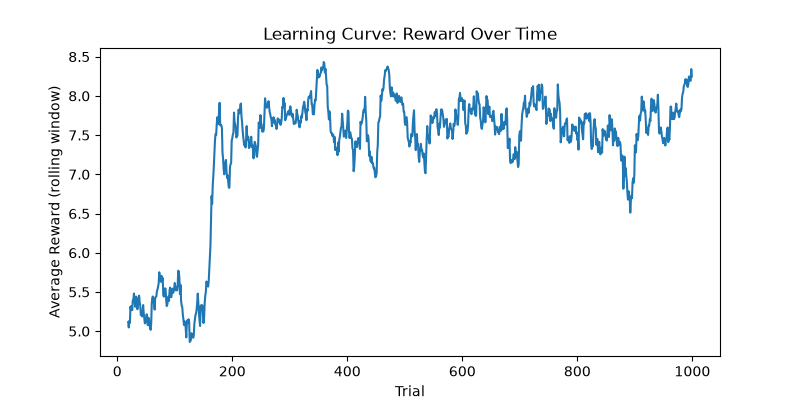
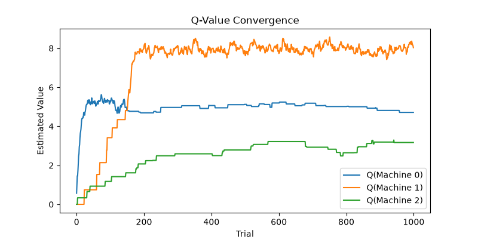
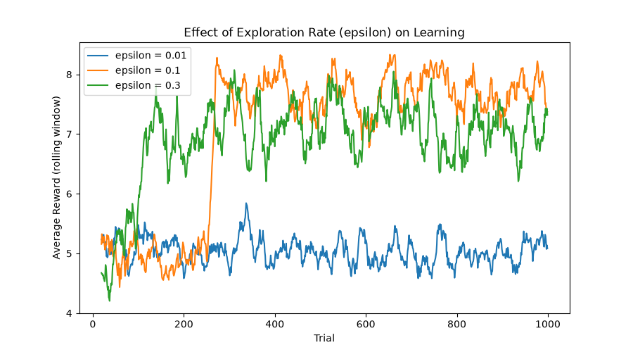

Here, α (alpha) is the **learning rate** — how much each new experience shifts the belief — and `(reward − Q(a))` is the **prediction error**: how far off the agent's expectation was. This single equation is the entire "learning" in this project.

**Simulation (`simulation.py`)**
Runs the agent through many trials (1000 by default), recording the action taken, reward received, and current value estimates at every step into a table using **pandas** (a Python library for working with tabular data, similar to a spreadsheet). This is saved as a CSV file — the same format commonly used for real behavioral experiment data.

**Visualization (`plot_results.py`)**
Uses **Matplotlib** (a Python plotting library) to turn that table into three plots:
- **Learning curve** — average reward over time, smoothed with a rolling average
- **Q-value convergence** — how the agent's belief about each arm evolves and settles
- **Action selection frequency** — how often each arm was ultimately chosen

**Exploration Rate Comparison (`compare_agents.py`, `plot_comparison.py`)**
Repeats the entire simulation three times with different epsilon values (0.01, 0.1, 0.3 — i.e., low, moderate, and high exploration) to directly compare how the exploration-exploitation tradeoff affects both how *fast* the agent learns and how *well* it ultimately performs.

## Getting Started

**Requirements:** Python 3.10+

```bash
git clone <your-repo-url>
cd reinforcement-learning-decision-making
python3 -m venv venv
source venv/bin/activate
pip install -r requirements.txt
```

**Run the core simulation:**
```bash
cd src
python simulation.py
python plot_results.py
```

**Run the exploration-rate comparison:**
```bash
python compare_agents.py
python plot_comparison.py
```

All outputs (CSVs and plots) are saved to the `results/` folder.

## Results

With a 3-armed bandit (true reward values: 5, 8, and 3), the agent reliably learns to favor the highest-value arm.





**Effect of exploration rate:**



With **epsilon = 0.01** (rarely explores), the agent explored too infrequently to reliably discover the best-performing arm, and its average reward stayed flat near 5 for the entire 1000 trials — a clear demonstration of the risk of too little exploration: the agent settles for a mediocre option simply because it never tries the better one enough times to notice it's better.

With **epsilon = 0.1** (moderate exploration), performance rose sharply around trial 250–300 as the agent discovered the optimal arm, then stabilized at the highest average reward of the three conditions (~8).

With **epsilon = 0.3** (frequent exploration), the agent found the optimal arm considerably faster (by roughly trial 100–150), but its long-run average reward settled lower (~7), because it kept sampling worse arms 30% of the time even after it had effectively already learned which arm was best.

**Takeaway:** these results illustrate the exploration-exploitation tradeoff at the heart of reinforcement learning — too little exploration risks never discovering the best option; too much exploration sacrifices long-run performance even after the best option is known. A moderate exploration rate achieved the best overall balance in this setting.

## What This Project Demonstrates

- Implementation of a foundational reinforcement learning algorithm (Q-learning with epsilon-greedy exploration) from first principles, using only NumPy
- Structuring simulation output as tabular data with pandas, in a format analogous to real trial-by-trial behavioral data
- Visualizing learning dynamics with Matplotlib
- An empirical investigation of the exploration-exploitation tradeoff, a central theme in both reinforcement learning and human/animal decision-making research

## Possible Extensions

- Compare the Q-learning agent against a simpler heuristic strategy (e.g. "win-stay, lose-shift": repeat the last action if it paid off, switch otherwise) to explore how more "habitual" strategies differ from value-based learning
- Introduce non-stationary reward probabilities (arms whose true value changes over time) to study how the agent adapts to a changing environment
- Fit the model to real behavioral choice data and use scikit-learn to compare its fit against alternative decision-making models

## Author

Tsedalemariam Getu
Addis Ababa University